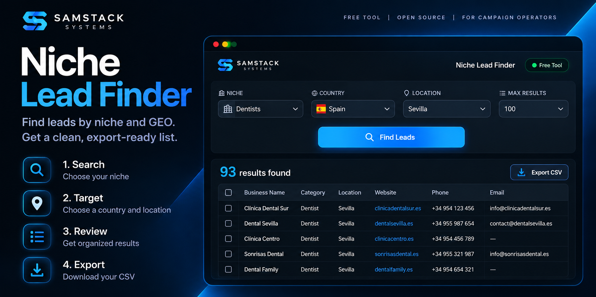

# Niche Lead Finder

### Find leads by niche and GEO. Build a clean, export-ready list.

A free and open-source tool by **Samstack Systems**

 

  

Free tools · New releases · Software & automation

  

  

**PICK A NICHE &nbsp;→&nbsp; CHOOSE YOUR GEO &nbsp;→&nbsp; FIND LEADS &nbsp;→&nbsp; EXPORT CSV**

---

## Why focused data beats blind volume

Sending more isn't always the answer.

Huge unfocused lists mean more infrastructure, more VPS resources, more domains, more processing, more time managing campaigns and more opportunities to burn resources on people who were never a good match in the first place.

**The better question isn't "How many can I send?"**

It's:
